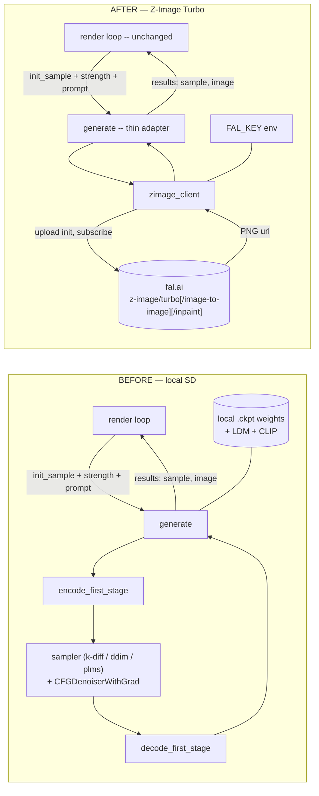

# refactor: Replace local Stable Diffusion backend with Z-Image Turbo (fal.ai)

## Summary

Deforum currently loads local Stable Diffusion `.ckpt` weights and runs the full latent-diffusion pipeline (encode → sample → decode) in-process on a GPU. This plan replaces that generation core with calls to the hosted **Z-Image Turbo** model on fal.ai, while leaving every layer that sits *above* generation untouched: 2D/3D motion warping, depth, keyframe/prompt scheduling, color coherence, contrast/anti-blur/noise, hybrid video, video-input mode, diffusion cadence, and ffmpeg assembly.

The key enabling fact: **Deforum's frame-to-frame coherence is already pixel-space, not latent-space.** The render loop warps the *previous decoded pixel frame*, noises it, and hands it to `generate()` as an init image; `generate()` re-encodes to latent fresh every frame (`helpers/render.py:391-462`, `helpers/generate.py:55-69`). There is no cross-frame latent continuity to preserve. The loop is fundamentally **img2img at a denoising strength on a warped previous frame** — and fal.ai ships exactly that: `fal-ai/z-image/turbo/image-to-image` with `image_url` + `strength`. So the swap is contained almost entirely inside `generate()` and `load_model()`; the animation engine above is model-agnostic.

A set of SD-internal features cannot survive an API boundary and are dropped (gradient-based conditioning guidance, sampler selection, CFG scale, per-step callbacks, raw-latent passing, embedding-slerp interpolation, 16/32-bit output). These are enumerated in **Assumptions** and **Features That Cannot Be Ported 1:1** below — none are part of the animation features the request requires to keep working.

---

## Problem Frame

The request: every place the pipeline loads SD weights, builds a sampler, and runs a diffusion step should instead call Z-Image Turbo; the animation/coords/keyframe/video logic stays intact. Constraints: keep 2D/3D motion, keyframe & prompt scheduling, coherence/init handling, and video output working; match existing code style; prefer full replacement over a dual backend unless a clean abstraction is cheap; add only the dependency the Z-Image Turbo client needs.

**Scope target.** Replace the generation core and its configuration surface across the whole codebase (both notebook entry points, the Replicate predictor, and helper modules). Out of scope: redesigning the animation engine, adding new motion features, deleting the vendored `src/` SD stack (left dead but in place to honor minimal-churn), and building a test framework beyond unit tests for the new code.

---

## Assumptions

Resolved autonomously (pipeline mode could not confirm interactively). Each is a decision the implementer should treat as settled unless contradicted by reality during execution.

1. **Integration target = fal.ai hosted API**, not local Z-Image weights. Endpoints (verified to exist with the needed parameters):
   - `fal-ai/z-image/turbo` — text-to-image (first frame / no-init).
   - `fal-ai/z-image/turbo/image-to-image` — accepts `image_url` + `strength` (0–1, default 0.6). This is the animation workhorse.
   - `fal-ai/z-image/turbo/inpaint` — accepts `image_url` + mask, for `use_mask`.
   - Shared params: `prompt`, `image_size` (preset string OR custom `{width,height}`), `num_inference_steps` (1–8, default 8), `seed`, `num_images`, `acceleration`, `output_format`. **No `guidance_scale` is exposed** (Turbo is guidance-distilled).
2. **Auth via `FAL_KEY` environment variable** (fal-client's native convention). Surfaced as a setup cell in the notebook and read from env in `predict.py`.
3. **Calls are synchronous** (`fal_client.subscribe`). Deforum generates frames serially (each frame depends on the previous), so async/batching buys nothing; sync keeps the loop shape identical.
4. **Full replacement, not a selectable backend.** A dual backend would require keeping the entire vendored GPU SD stack (`src/ldm`, `src/k_diffusion`, `src/clip`, `src/taming`, ~28k LOC) plus a CUDA runtime *and* the API path. That is not a "low-cost abstraction" — it is the most expensive option — so the stated default (full replace) holds.
5. **Strength is inverted between conventions** (see KTD-2). Deforum: higher strength → more faithful to init. fal: lower strength → more faithful to source. Mapping: `fal_strength = clamp(1.0 - deforum_strength, 0, 1)`.
6. **`steps` is clamped to 1–8** (Z-Image Turbo maximum). Deforum's default of 50 maps to 8.
7. **Visual output and coherence tuning will change.** It is a different model; the existing default `strength_schedule` (0.65) and `noise_schedule` may need re-tuning for pleasing motion. This is expected, not a defect.

---

## Key Technical Decisions

### KTD-1 — Contain the swap inside `generate()` + `load_model()`; preserve their contracts

`generate(args, root, ...)` keeps its signature and its return-value contract: a `results` list of images, plus the `(sample, image)` two-tuple shape when `return_sample=True`. The render loop consumes `sample` as the next frame's warp source; we reconstruct that `[-1,1]`, `[1,3,H,W]` float16 tensor from the returned PNG via `sample_from_cv2(np.array(pil_image))` (`helpers/animation.py:17`). Because the contract is preserved, `render_animation`, `render_input_video`, and `render_image_batch` need **no structural change** — only removal of SD-only knobs they pass through.

`root.model` stops being an LDM module and becomes a lightweight client handle (endpoint config + resolved auth). Every `root.model.<sd-internal>` call site (`helpers/generate.py`, `helpers/callback.py`) is removed or rerouted.

### KTD-2 — Strength inversion is the linchpin of animation continuity

Deforum computes `t_enc = int((1.0 - strength) * steps)` (`helpers/generate.py:110`): higher `strength` → fewer denoising steps → output closer to init → **more** coherence. fal's `strength` is the opposite ("lower values preserve more source"). The adapter must apply `fal_strength = clamp(1.0 - args.strength, 0, 1)`. Getting this backwards produces either frozen video (no change) or incoherent strobing (no continuity). This mapping gets an explicit unit test.

### KTD-3 — Endpoint routing by request shape

Inside the adapter:
- `use_mask` true (and mask available) → **inpaint** endpoint.
- else init present (`init_sample`/`init_latent` set, or `use_init` + `init_image` + `strength > 0`) → **image-to-image** endpoint.
- else → **text-to-image** endpoint.

This mirrors the existing branch structure in `generate.py:55-74` and `generate.py:236-241`, so the render loop's existing init/strength signaling drives endpoint choice with no loop changes.

### KTD-4 — Init images are uploaded, not latent-encoded

The render loop produces a pixel init (`args.init_sample`, a `[-1,1]` tensor) or an `init_image` path/URL. The adapter converts the pixel init to a PIL image (`sample_to_cv2` → PIL) and obtains a URL via `fal_client.upload_image(...)` (or a data URI), then passes it as `image_url`. Pixel-space pre-processing the loop already applies (warp, color match, contrast, unsharp, `add_noise`) is retained as-is — it all happens before `generate()` is called.

### KTD-5 — New network failure mode needs a retry wrapper

The old pipeline never failed mid-run on the network. Per-frame API calls introduce transient failures that would abort a 1000-frame render. The client wrapper adds bounded retry with backoff and a clear error if `FAL_KEY` is missing/invalid, so a single blip doesn't lose an entire animation.

### KTD-6 — Keep vendored `src/` SD stack in place but dead

Per the minimal-churn constraint, we do **not** delete `src/ldm`, `src/k_diffusion`, `src/clip`, `src/taming`. We sever the import-level coupling in `helpers/` so they're unused for generation. `src/midas` (depth) and `src/py3d_tools` (3D transforms) remain **live** — depth warping is model-independent and stays. Removing the dead stack is noted as follow-up.

---

## High-Level Technical Design

### Before → After (generation core)



### Per-animation-frame sequence (after)

```mermaid
sequenceDiagram
    participant RL as render_animation
    participant G as generate (adapter)
    participant C as zimage_client
    participant F as fal.ai
    RL->>RL: warp prev frame (2D/3D + depth), color match, contrast, unsharp, add_noise
    RL->>G: args.init_sample, strength, prompt, W/H, seed, steps
    G->>G: route by shape (KTD-3); fal_strength = 1 - strength (KTD-2)
    G->>C: img2img(prompt, init_pil, fal_strength, size, seed, steps→clamp 1-8)
    C->>F: upload_image + subscribe (sync, retry on transient)
    F-->>C: result image URL
    C-->>G: PIL image
    G->>G: sample = sample_from_cv2(np.array(image))
    G-->>RL: [sample, image]   %% contract preserved
    RL->>RL: prev_sample = sample → next frame
```

The architecture (3+ components with directed data flow) and the multi-step per-frame protocol both warrant these sketches; prose alone would obscure that the render loop is untouched and only the core is rerouted.

---

## Implementation Units

### U1. Add fal-client dependency and FAL_KEY auth plumbing

**Goal:** Make the fal.ai client installable and the API key resolvable in all three runtime entry points (Colab notebook, local `.py`, Replicate `cog`).

**Requirements:** Assumptions 1–2; "add only the dependency the client needs".

**Dependencies:** none.

**Files:**
- `cog.yaml` — add `fal-client` to `python_packages`.
- `install_requirements.py` — add `fal-client` to the `common` list.
- `Deforum_Stable_Diffusion.py` — environment setup cell package list; add a key-setup step (read `FAL_KEY` from env, prompt/`getpass` if absent).
- `Deforum_Stable_Diffusion.ipynb` — mirror the `.py` changes (see "Notebook sync" note).

**Approach:** `fal-client` is the only new dependency. Auth follows fal-client's native `FAL_KEY` env convention — no bespoke credential store. In Colab, surface a single cell that sets `os.environ["FAL_KEY"]`. Heavy GPU deps (pytorch-lightning, xformers, open-clip, k-diffusion extras) are now unused for generation but are **left installed** (depth/MiDaS still needs torch); a follow-up can trim them.

**Patterns to follow:** existing `setup_environment()` package-list style in `Deforum_Stable_Diffusion.py:50-59`; existing `python_packages` block in `cog.yaml`.

**Test scenarios:**
- Unit: a `resolve_fal_key()` helper returns the env value when `FAL_KEY` is set, and raises a clear, actionable error when it is unset/empty. (input: env present/absent → expected: value / `RuntimeError` naming `FAL_KEY`.)
- `Test expectation: none` for the `cog.yaml`/install-list edits (pure dependency declaration).

---

### U2. Build the Z-Image Turbo client wrapper

**Goal:** A single new module that encapsulates all fal.ai interaction: endpoint constants, request building, image upload, synchronous submit with retry, and PIL-image return.

**Requirements:** Assumptions 1,3,5,6; KTD-2, KTD-3, KTD-4, KTD-5.

**Dependencies:** U1.

**Files:**
- `helpers/zimage_client.py` (new) — `txt2img(...)`, `img2img(...)`, `inpaint(...)`, an internal `_submit(endpoint, arguments)` with retry/backoff, `to_fal_strength(deforum_strength)`, `clamp_steps(steps)`, and `image_size_arg(W, H)`.
- `tests/test_zimage_client.py` (new) — pure-logic + mocked-client tests.

**Approach:** Functions accept already-prepared inputs (a PIL image for init/mask, prompt string, W/H, seed, steps, deforum-strength) and return a PIL image. `_submit` wraps `fal_client.subscribe(endpoint, arguments=...)`; init/mask images are uploaded via `fal_client.upload_image(...)` to get `image_url`. `image_size_arg` returns a custom `{"width": W, "height": H}` object (W/H already forced to /64 upstream). Retry: bounded attempts with exponential backoff on transient/network errors; non-retryable auth errors fail fast with a clear message. No animation logic lives here — this module is model-API-only and unit-testable by mocking `fal_client`.

**Patterns to follow:** keep module-level helper style consistent with `helpers/k_samplers.py` (plain functions, typed signatures). Match existing import ordering (stdlib / third-party / local).

**Test scenarios:**
- `to_fal_strength`: deforum 0.65 → ~0.35; 0.0 → 1.0; 1.0 → 0.0; out-of-range clamps to [0,1]. (Covers KTD-2.)
- `clamp_steps`: 50 → 8; 0 → 1; 4 → 4; negative → 1.
- `image_size_arg`: (512,512) → `{"width":512,"height":512}`.
- Routing helpers (if exposed): given args shape → correct endpoint constant (mask→inpaint, init→i2i, else→t2i). (Covers KTD-3.)
- `_submit` retry: mock `fal_client.subscribe` to raise a transient error N-1 times then succeed → returns image; raise auth error → fails immediately with `FAL_KEY` message. (Covers KTD-5.)
- `img2img`/`txt2img` happy path: mock subscribe + upload → returns a PIL image of expected mode/size.

---

### U3. Rewrite `generate()` as a thin adapter over the client

**Goal:** Replace the latent-diffusion body of `generate()` with endpoint routing while preserving its signature and `results`/`return_sample` contract.

**Requirements:** keep animation/init/coherence working; KTD-1, KTD-3, KTD-4.

**Dependencies:** U2.

**Files:**
- `helpers/generate.py` — rewrite the function body; remove imports of `k_samplers`, `model_wrap`, `conditioning`, `ldm.*`, `k_diffusion.*`, and the per-step `SamplerCallback` construction.
- `tests/test_generate_adapter.py` (new).

**Approach:** New flow: seed → resolve prompt(s) → determine endpoint by request shape (KTD-3) → build the init/mask PIL image from `args.init_sample` (`sample_to_cv2` → PIL) or `args.init_image` (load/download) → call the matching `zimage_client` function with `fal_strength` and clamped steps → receive PIL image → assemble `results`. When `return_sample=True`, prepend `sample_from_cv2(np.array(image))` so the render loop's warp source is intact. Honor `bit_depth_output==8` only (see Features That Cannot Be Ported). Drop `return_latent`/`return_c` support (raise a clear `NotImplementedError` if requested, so the substitute in U6 is explicit rather than silently wrong). Keep `add_noise` import (still used by `render.py`).

**Patterns to follow:** preserve the existing `results.append(...)` image-formatting tail (`generate.py:285-302`) for 8-bit output so downstream save/display is unchanged.

**Test scenarios:**
- Happy path (no init): mock `zimage_client.txt2img` → `generate(args, root)` returns a one-element `results` list with a PIL/np image.
- Happy path (init + strength): with `args.init_sample` set and `strength>0`, the adapter calls `img2img` (not `txt2img`) with `fal_strength == 1-strength`. (Covers KTD-3, KTD-2.)
- `return_sample=True`: returns `[sample, image]` where `sample` is `[1,3,H,W]`, dtype float16, range within [-1,1]. (Covers KTD-1 contract; this is what `render_animation` consumes at `render.py:502`.)
- Mask path: `use_mask=True` with a mask routes to `inpaint`.
- `return_latent`/`return_c=True` → raises `NotImplementedError` with a message pointing at interpolation substitute.
- Edge: `strength` auto-zeroed when `use_init` false and `strength_0_no_init` true still yields txt2img (preserve `generate.py:71-74` behavior).

---

### U4. Replace model loading and sever `root.model` SD coupling

**Goal:** `load_model()` stops downloading/instantiating SD weights and instead returns a client handle; all remaining `root.model.<sd-internal>` references are removed.

**Requirements:** "every place that loads SD weights / builds a sampler"; KTD-1, KTD-6.

**Dependencies:** U3.

**Files:**
- `helpers/model_load.py` — replace `load_model()` body: drop `model_map` (the SD `.ckpt` table at `model_load.py:90-176`), `download_model`, sha256 check, `instantiate_from_config`, `.half().to(device)`. Return a `(client_handle, device)` where `client_handle` carries endpoint config + resolved key. Keep `get_model_output_paths`. Retire `make_linear_decode`/`linear_decode` (gradient-only) — remove or no-op.
- `helpers/callback.py` — `SamplerCallback` is per-step and SD-only; remove its construction from `generate.py` (U3) and reduce this file to unused/removed. Per minimal churn, leave the file present but no longer imported, or delete if nothing references it (grep first).
- `Deforum_Stable_Diffusion.py` — `ModelSetup()` cell: replace `model_config`/`model_checkpoint`/`custom_*` SD selectors with Z-Image config (endpoint choice, `acceleration`, key); update the `load_model(...)` call.
- `Deforum_Stable_Diffusion.ipynb` — mirror.
- `predict.py` — `setup()` and `predict()`: drop `load_model_from_config`, the `MODEL_CACHE` ckpt load, the `model_checkpoint` Input choices, and `make_linear_decode`; build the client handle from `FAL_KEY` instead.

**Approach:** `root.model` becomes data, not a network module. Validate `FAL_KEY` at load time so failures surface before the render loop starts, not on the first frame. Depth model loading (`DepthModel`, `render.py:250-260`) is untouched — it loads MiDaS/AdaBins from `models_path` independently.

**Patterns to follow:** keep `load_model` returning a 2-tuple `(model, device)` so `Deforum_Stable_Diffusion.py:122` and `predict.py` call sites stay structurally identical.

**Test scenarios:**
- Unit: `load_model` with `FAL_KEY` set returns a handle exposing the configured endpoints + device; with key unset raises the U1 error.
- Grep verification (manual): no remaining `root.model.encode_first_stage|decode_first_stage|get_learned_conditioning|get_first_stage_encoding|ema_scope|parameterization|stochastic_encode` anywhere in `helpers/` or `predict.py`.
- `Test expectation: none` for notebook-cell edits beyond the load_model unit (UI scaffolding).

---

### U5. Prune SD-only knobs from settings, args, and entry UIs

**Goal:** Remove or neutralize every SD-specific parameter surfaced in the args dicts, notebook cells, predictor inputs, and the sampler-schedule path in the render loop.

**Requirements:** "Update or remove SD-specific parameters wherever they're surfaced"; Assumption 6,7; Features That Cannot Be Ported.

**Dependencies:** U3, U4.

**Files:**
- `Deforum_Stable_Diffusion.py` — `DeforumArgs()`: remove `sampler`, `scale`, `ddim_eta`, `dynamic_threshold`, `static_threshold`, the entire conditional-gradient block (`mean_scale`/`var_scale`/`exposure_*`/`colormatch_*`/`clip_*`/`aesthetics_*`/`init_mse_*`/`blue_scale`/`gradient_wrt`/`gradient_add_to`/`decode_method`/`grad_threshold_type`/`clamp_*`/`grad_inject_timing`/`cond_uncond_sync`), `save_sample_per_step`/`show_sample_per_step`; change `steps` default to 8 with a clamp note; restrict `bit_depth_output` to 8; add `acceleration`. `DeforumAnimArgs()`: remove `enable_schedule_samplers`/`sampler_schedule`. Remove the CLIP/aesthetics model-load block (`Deforum_Stable_Diffusion.py:375-379`) and the PLMS/ddim sampler fix-ups (`:385-389`).
- `Deforum_Stable_Diffusion.ipynb` — mirror.
- `predict.py` — drop `sampler`, `guidance_scale`, `clip_name`, `num_inference_steps` upper bound → clamp to 8, and the conditioning-related dict keys; drop the sampler fix-up block (`predict.py:502-508`) and CLIP load block (`:487-496`).
- `helpers/render.py` — neutralize the sampler-schedule application (`render.py:303-305`, `:472-476`) and the per-frame sampler prints; they reference removed knobs.
- `helpers/settings.py` — no code change needed (it copies whatever keys exist), but verify removed keys don't break `load_args` for old settings files (it already guards with `if k in jdata`).

**Approach:** Deletion over dead-flagging for user-facing knobs, so the notebook/predictor surface honestly reflects the model. `settings.py` already tolerates missing keys, so old saved `.txt`/`.json` settings still load (unknown SD keys are simply ignored on read; removed-from-args keys are skipped). Note in README that old settings files keep loading but their SD-only fields are inert.

**Patterns to follow:** the `#@param` comment style and `locals()` return in `DeforumArgs`/`DeforumAnimArgs`.

**Test scenarios:**
- Unit: constructing `args` from the new `DeforumArgs()` exposes no removed attribute and includes `num_inference_steps`/`acceleration`; `steps` clamps to 8 when a settings file injects 50. (Covers Assumption 6.)
- Regression: `load_args` against a legacy settings file containing `sampler`/`scale`/`clip_scale` loads without error and those keys do not appear on `args`. (Covers the settings.py guard.)
- `helpers/render.py`: with `enable_schedule_samplers` removed, the render loop runs a frame without referencing `args.sampler`. (Integration-style; exercised in U7 manual run.)

---

### U6. Interpolation-mode substitute and mask via inpaint

**Goal:** Provide a working path for the two features that depended on now-removed SD internals: embedding-slerp interpolation and masked generation.

**Requirements:** "do not silently drop a feature — propose the closest workable substitute"; keep coherence/init handling working.

**Dependencies:** U2, U3.

**Files:**
- `helpers/render.py` — `render_interpolation()` (`render.py:565-684`): replace the CLIP-embedding `init_c` slerp (`:623`, `:649`, `:669`) with pixel-space interpolation — generate one image per key prompt via the adapter, then interpolate intermediate frames with `helpers/interpolation.py` / existing tween machinery. Remove `return_c` usage.
- `helpers/generate.py` + `helpers/zimage_client.py` — ensure the mask path builds a mask PIL image and routes to the inpaint endpoint (whole-image mask, since per-step latent mask blending in `callback.py:98-121` is gone).
- `tests/test_generate_adapter.py` — extend for mask routing (overlaps U3; keep the assertion here for the substitute path).

**Approach:** Interpolation becomes "render keyframes, then blend in pixel space." This is a documented behavior change — smoother prompt-to-prompt morphs (embedding slerp) are not reproducible without model internals, but a usable interpolation remains. Masking moves from per-denoising-step latent compositing to the model's native inpaint endpoint; `mask_brightness_adjust`/`mask_contrast_adjust`/`invert_mask` pre-processing stays (pixel-space), `overlay_mask` final-composite stays (`generate.py:263-275` logic, pixel-space) — only the per-step blend is dropped.

**Patterns to follow:** reuse `interpolate(...)` from `helpers/interpolation.py` already imported by `render.py:23`.

**Test scenarios:**
- Unit: `render_interpolation` no longer references `args.init_c`; given 2 key prompts and N intermediate frames it requests `2` generations and produces `N` interpolated outputs (mock the adapter + interpolation). 
- Mask: `generate` with `use_mask` + a mask image routes to `inpaint` and still applies `overlay_mask` final composite. (Covers the substitute.)
- Edge: interpolation with reversed/duplicate keyframes prints the existing "key frames duplicated or reversed" guard and returns cleanly (`render.py:614-616`).

---

### U7. Documentation, config notes, and end-to-end manual verification

**Goal:** Update user-facing docs to the new model, auth, removed features, and cost/latency profile; run a real short animation to confirm the swap end-to-end.

**Requirements:** "Report what each SD concept maps to and what couldn't be ported"; Operational notes.

**Dependencies:** U1–U6.

**Files:**
- `README.md` — replace SD model/checkpoint instructions with Z-Image Turbo + `FAL_KEY` setup; document removed knobs, the strength inversion, the 1–8 step clamp, 8-bit-only output, the interpolation/mask substitutes, and per-frame cost (~$0.005/megapixel) + network-latency caveat.
- `configs/*.yaml` — note (in README) that these SD inference configs are now unused; leave files in place (minimal churn).

**Approach:** Include the SD→Z-Image concept-mapping table directly in the README so the "what maps to what" report is durable, not just a PR comment.

**Test scenarios:**
- `Test expectation: none` (docs).
- **Manual verification (requires `FAL_KEY` + network):**
  1. Run a 3–5 frame 2D animation → frames are produced, motion is visible, frames are coherent (not identical, not strobing) — validates KTD-2 strength mapping end-to-end.
  2. Run a 3-frame 3D animation with `use_depth_warping=True` → depth warp still applied (depth model independent of backend).
  3. Run a single no-init image batch → txt2img path produces an image.
  4. Run Video Input mode on a 3-frame clip → img2img per input frame.
  5. Assemble frames with the ffmpeg cell → valid `.mp4`.

---

## Scope Boundaries

**In scope:** generation core swap (`generate`, `load_model`), client wrapper, auth, knob pruning across notebook/`.py`/predictor/render, interpolation & mask substitutes, docs, unit tests for new logic, manual e2e verification.

### Deferred to Follow-Up Work
- Deleting the now-dead vendored `src/ldm`, `src/k_diffusion`, `src/clip`, `src/taming` and trimming heavy GPU deps (torch stays for depth) from `cog.yaml`/`install_requirements.py`.
- LoRA / ControlNet endpoints (`fal-ai/z-image/turbo/lora`, `.../controlnet`) — available but out of the current request.
- Re-tuning default `strength_schedule`/`noise_schedule` for Z-Image's aesthetic.
- A real integration-test harness that hits fal.ai behind a network flag.

### Features That Cannot Be Ported 1:1 (dropped, with rationale)
| SD feature | Why it can't cross the API boundary | Disposition |
|---|---|---|
| Conditioning guidance (`clip`/`aesthetics`/`colormatch`-loss/`mse`/`blue`/`mean`/`var`/`exposure` scales) | Requires latent-space autograd via `CFGDenoiserWithGrad` | Removed. (Note: pixel-space frame-to-frame **color coherence** via `maintain_colors` is retained — only the *gradient* color loss is gone.) |
| Sampler selection (`klms`/`dpm2`/`euler`/`ddim`/`plms`/…) + `sampler_schedule` | Turbo has a fixed internal scheduler | Removed (no-op). |
| CFG `scale` / `ddim_eta` | No `guidance_scale` in the Turbo API | Removed. |
| Per-step callback: dynamic/static thresholding, `save/show_sample_per_step`, per-step latent mask blend | API is a black box; no per-step access | Removed; masking → inpaint endpoint. |
| Raw latent passing (`init_latent`, `init_c`), `return_latent`/`return_c` | No latent/embedding exposure | Removed; interpolation → pixel-space substitute (U6). |
| 16/32-bit output | API returns 8-bit PNG/JPEG | Clamped to 8-bit. |

---

## Risks & Dependencies

- **Strength inversion errors (high impact, low effort to prevent):** mitigated by KTD-2's explicit unit test and manual verification scenario 1.
- **Per-frame latency & cost (operational):** serial calls add network latency per frame and ~$0.005/MP; a long render is slower and metered vs. local GPU. Documented; retry wrapper (KTD-5) prevents single-blip aborts.
- **Notebook sync drift:** `Deforum_Stable_Diffusion.py` and `.ipynb` mirror each other (jupytext/colab-convert cell markers). Edits must land in both, or be regenerated from one source. **Verify both files render identical cells** before completion.
- **Aesthetic divergence:** output will not look like the prior SD model; coherence defaults may need re-tuning (Assumption 7).
- **Dependency:** `fal-client` availability and the stability of the `fal-ai/z-image/turbo*` endpoint schemas.

---

## SD → Z-Image Turbo Concept Mapping (report artifact)

| Deforum / SD concept | Z-Image Turbo (fal.ai) equivalent |
|---|---|
| Load `.ckpt` + LDM in-process | Resolve `FAL_KEY`; client handle (no weights) |
| txt2img (no init) | `fal-ai/z-image/turbo` |
| img2img (warped prev frame as init) | `fal-ai/z-image/turbo/image-to-image`, `image_url` + `strength` |
| masked generation | `fal-ai/z-image/turbo/inpaint` |
| `strength` (higher = more faithful) | `strength` **inverted**: `1 - strength` (lower = more faithful) |
| `steps` (e.g. 50) | `num_inference_steps`, clamped 1–8 |
| `W`/`H` (×64) | `image_size` custom `{width,height}` |
| `seed` | `seed` |
| CFG `scale`, sampler, `ddim_eta` | (none — model-fixed) |
| latent encode/sample/decode | server-side, opaque |
| 2D/3D warp, depth, color coherence, hybrid, cadence, ffmpeg | **unchanged** (pixel-space, above the backend) |
